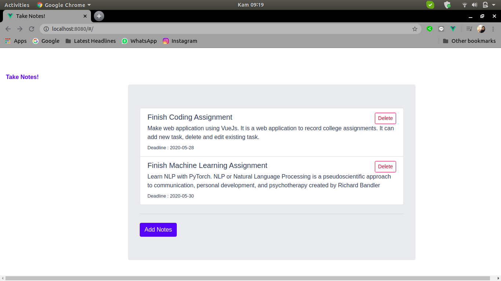
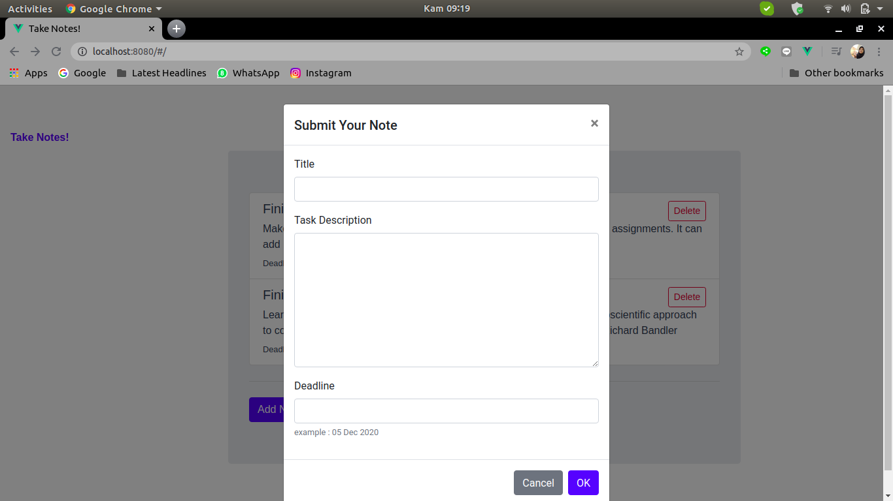
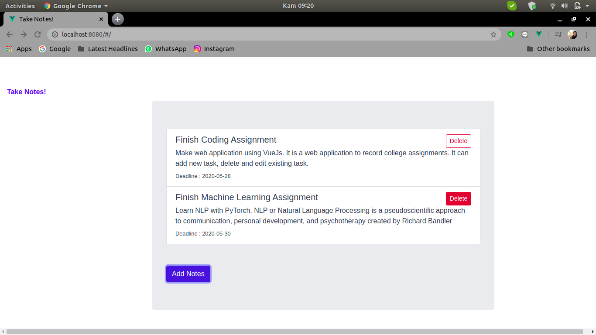
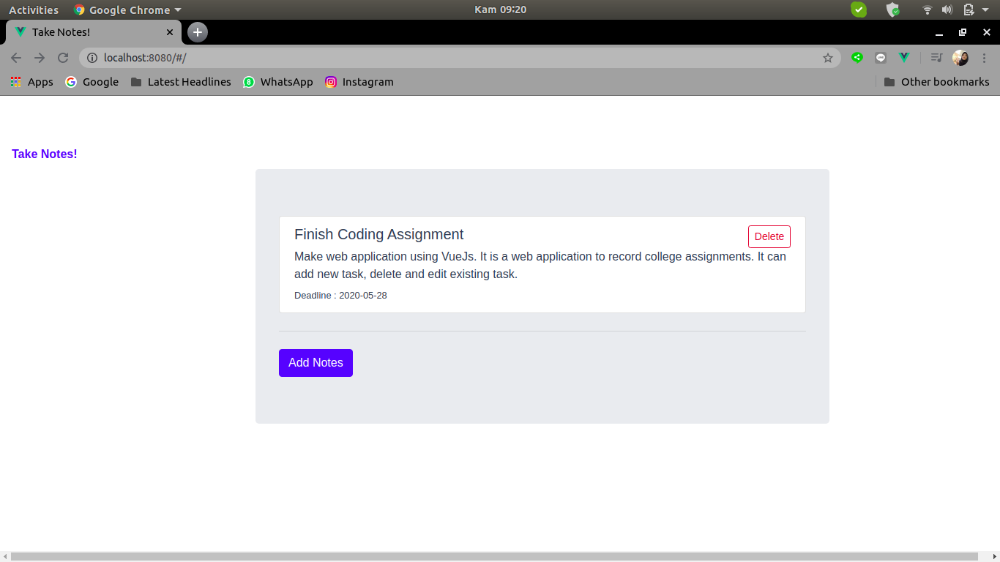
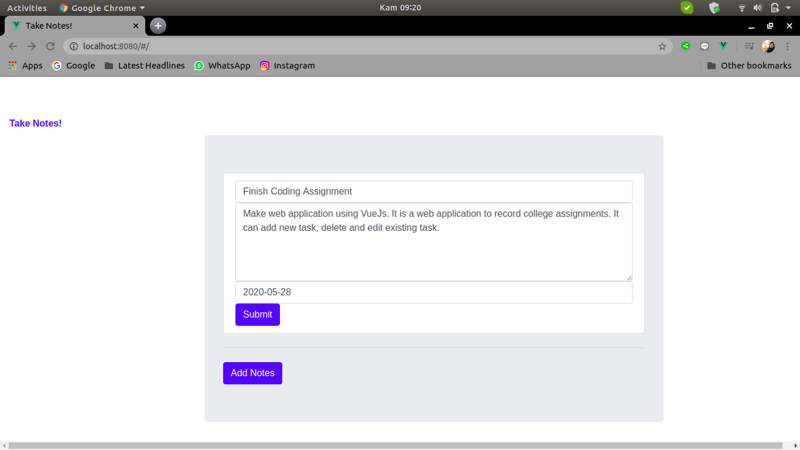

# take_notes

## About
Take Notes! web application is a web aplication to record college assignments. It is created using VueJS.

## Project setup
```
npm install
```

### Compiles and hot-reloads for development
```
npm run serve
```

### Compiles and minifies for production
```
npm run build
```

### Lints and fixes files
```
npm run lint
```

### Customize configuration
See [Configuration Reference](https://cli.vuejs.org/config/).

## Screenshots of Application
### Take Notes!

### Add A Note

### Delete A Note


### Edit A Note
